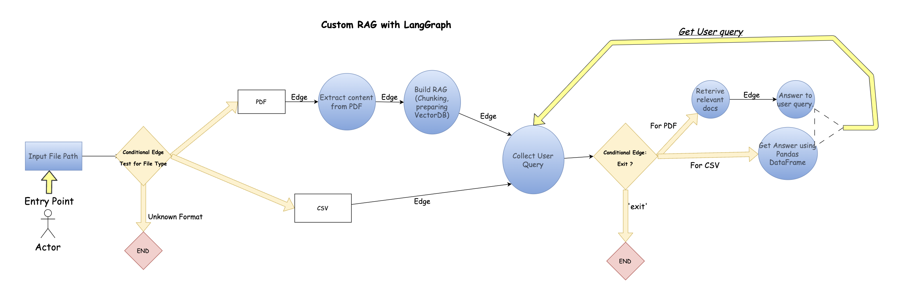

# Multi-Agent RAG System with Workflow Automation using LangGraph

This project implements a Multi-Agent Reinforcement Learning Answer Graph (RAG) system along with workflow automation for processing PDF and CSV files. The system is designed to extract information from documents, build a knowledge graph, and provide answers to user queries.

## Overview

The project utilizes a combination of machine learning models, including OpenAI's GPT-3.5, Pinecone vector database, and custom-designed agents to accomplish the following tasks:

- **File Processing**: Detects the type of input file (PDF or CSV) and routes the workflow accordingly.
- **PDF Analysis**: Extracts text content from PDF files using the Unstructured module.
- **RAG Building**: Constructs a RAG system and prepares the Pinecone vector database for document embeddings.
- **User Interaction**: Allows users to input queries for information retrieval.
- **Answer Generation**: Generates answers to user queries based on the constructed RAG and input documents.
- **CSV Analysis**: Performs analysis on CSV files using Pandas DataFrame.

## Workflow Graph



## Components

- **Agents**: Custom agents are created to handle different tasks such as PDF extraction, CSV analysis, and answer generation.
- **State Graph**: Defines the workflow logic using a state graph, with conditional edges based on file type and user queries.
- **Pinecone Vector Database**: Utilizes Pinecone as a scalable vector database for storing document embeddings.
- **OpenAI Models**: Integrates OpenAI's GPT-3.5 model for natural language processing tasks.

## Usage

To use the system:

1. Ensure you have Python installed along with the necessary dependencies listed in `requirements.txt`.
2. Set up environment variables as specified in the `.env` file.
3. Execute the `main.py` script with the appropriate input file path.
4. Follow the prompts to input queries and interact with the system.

## Example

```python
inputs = {
    'file_path': '/path/to/your/input/file.pdf'
}

config = {"recursion_limit": 7}

app.invoke(inputs, config=config)
```

## Dependencies

- Python 3.10
- OpenAI's GPT-3.5
- Pinecone
- Pandas
- dotenv
- langchain
- langgraph
- langchain_openai

## Contributing

Contributions are welcome! Feel free to submit issues or pull requests for any improvements or bug fixes.

## License

This project is licensed under the [MIT License](LICENSE).
